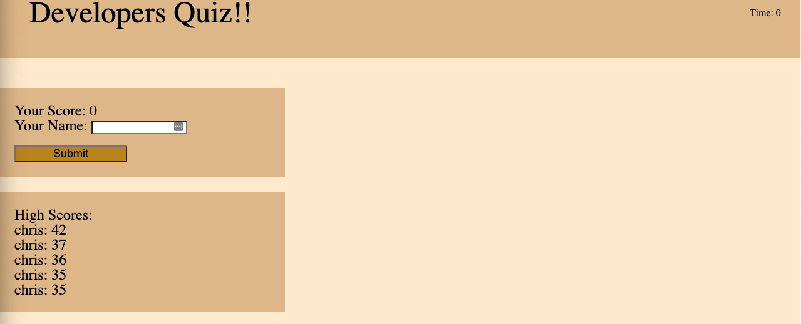

# developers-quiz
Developer: Christopher Borer
Created: 04/02/2022

Summary:
This is a timed quiz that stores name, and high scores and returns those values to the user.

Criteria:
1. Games starts when user clicks the start button
2. Timer starts and questions displays.
3. The timer is set to provied 5 seconds for each question.
4. Question come from an array of questions embeded in the javascript.
5. When the question is answered correctly an additional 5 seconds is added to the timer.
6. when the question is answered incorrectly 2 seconds are removed from the score.
7. Final score is based on how much time is left after all the questions are answered.
8. When the timer runs out or all the questions are answered the game will be done.
9. If all questions are answered the score is posted with a text box for user to enter their name along with the top 5 high scores recorded.
10. Once the name is submitted it goes back to the start page.
11. if the timer runs out it will show the score of 0 and input text for name with the top 5 scores.

github link to the final version of code.
This site was built using [GitHub Pages](https://cspower5.github.io/developers-quiz/)

